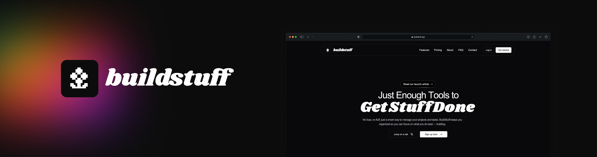

# 🛠️ BuildStuff

**BuildStuff** is a lightweight, open-source project management tool designed for solo developers, freelancers, and small teams who want a simple, no-fuss way to track tasks, manage projects, and log work hours — without the unnecessary bloat.

## 🌟 Features

- **Multiple Workspaces**: Manage separate workspaces for different clients, teams, or projects.
- **Project & Task Management**: Create projects, add tasks, and keep everything organized.
- **Subtasks & Time Tracking**: Break down tasks into subtasks and track time spent on each.
- **Changelog & Notes**: Keep a project changelog or jot down notes with Markdown support.
- **File Attachments**: Attach images, documents, or files to projects and tasks for better documentation.
- **Flexible User Access**: Users can join multiple workspaces and see a unified dashboard of all their tasks.
- **Simple Authentication**: Sign in with email, Google, or GitHub.
- **Kanban Board**: Visualize your tasks and projects with a simple drag-and-drop Kanban board.
- **Dark Mode**: Built-in dark mode for those late-night coding sessions.
- **Open Source & Extensible**: Easily customizable and ready for your contributions!

## 🚀 Getting Started

Follow these steps to set up BuildStuff locally.

### Prerequisites

- **Node.js** (v20+)
- **PostgreSQL**
- **Git**

### Installation

1. **Clone the repository:**

   ```bash
   git clone https://github.com/fres-sudo/buildstuff.git
   ```

   ```bash
    cd buildstuff
   ```

2. **Install dependencies:**

```bash
npm install
```

3. **Set up environment variables,** copy the example environment file and update it with your configuration:

```bash
cp .env.example .env
```

Update the `.env` file with your PostgreSQL credentials, OAuth keys, and any other necessary configurations.

4. **Set up the database,** initialize the database with Drizzle ORM

```bash
npx drizzle-kit migrate:latest
```

5. **Start the development server:**

```bash
    npm run dev
```

Access the app: Open [http://localhost:3000](http://localhost:3000) in your browser.

## 🛠️ Tech Stack

- Frontend: [Next.js](https://nextjs.org/), [Tailwind CSS](https://tailwindcss.com/)
- Backend: [Drizzle ORM](https://orm.drizzle.team/), [PostgreSQL](https://www.postgresql.org/)
- Authentication: [Better Auth](https://www.better-auth.com/)
- Deployment: [Vercel](https://vercel.com/), [Docker](https://www.docker.com/) (optional)
- Markdown Editor: [Tip Tap](https://tiptap.dev/product/editor)

## 📚 Documentation

For detailed setup instructions, API documentation, and usage guides, visit the [**BuildStuff Documentation**]().

##🤝 Contributing

We welcome contributions from the community! Whether you want to fix a bug, suggest a feature, or improve the docs, we'd love your help.

1. Fork the **repository**

2. Create a new **branch**:

```bash
git checkout -b feature/your-feature-name
```

3. Make your changes and **commit**:

```bash
git commit -m "Add your feature or fix"
```

4. **Push** your changes:

```bash
    git push origin feature/your-feature-name
```

5.Create a [**pull request**](https://github.com/fres-sudo/buildstuff/pulls)

Check out our [Contributing Guide](https://github.com/fres-sudo/buildstuff/blob/main/CONTRIBUTE.md) for more details.

## 🐛 Reporting Bugs

Found a bug? Please open an [issue](https://github.com/fres-sudo/buildstuff/actions/new) and let us know the details.

## 📈 Roadmap

**Planned** features and enhancements:

- Notifications & Reminders
- Offline Mode with Sync
- API & Webhook Integrations
- More Authentication Options (Apple Sign-In)
- Improved Mobile Experience

## ❤️ Support

If you find BuildStuff helpful, please give us a ⭐ on GitHub! It helps others find the project too.

## 📝 License

This project is licensed under the MIT License - see the LICENSE file for details.

## 🙌 Acknowledgments

    Thanks to the open-source community for your contributions and feedback.
    Special thanks to all contributors who helped make this project better.
